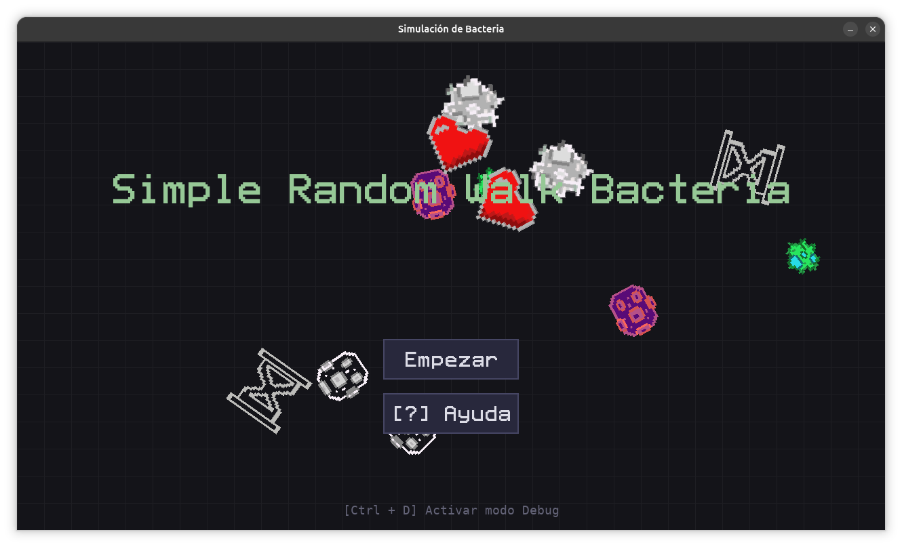
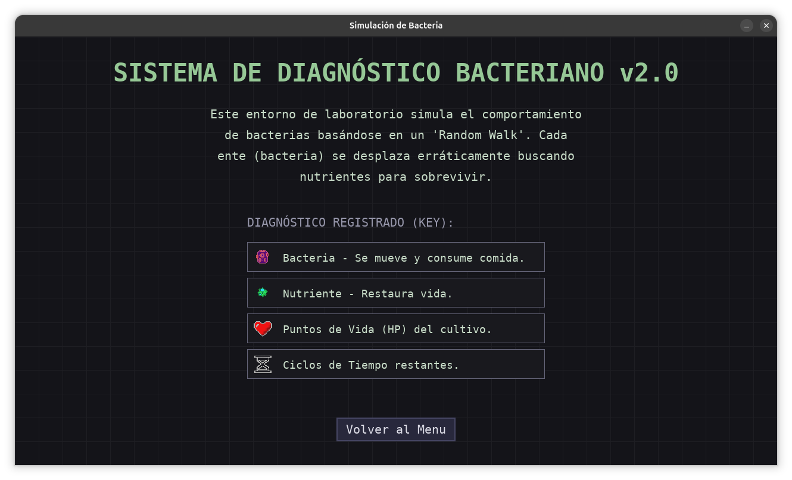
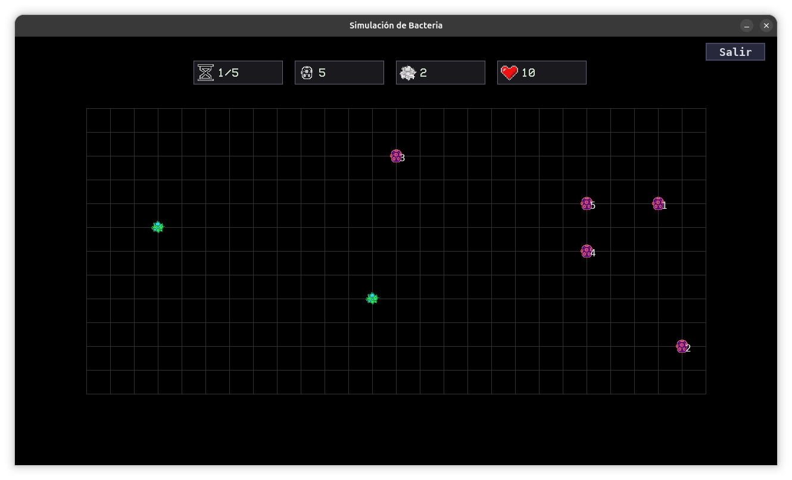
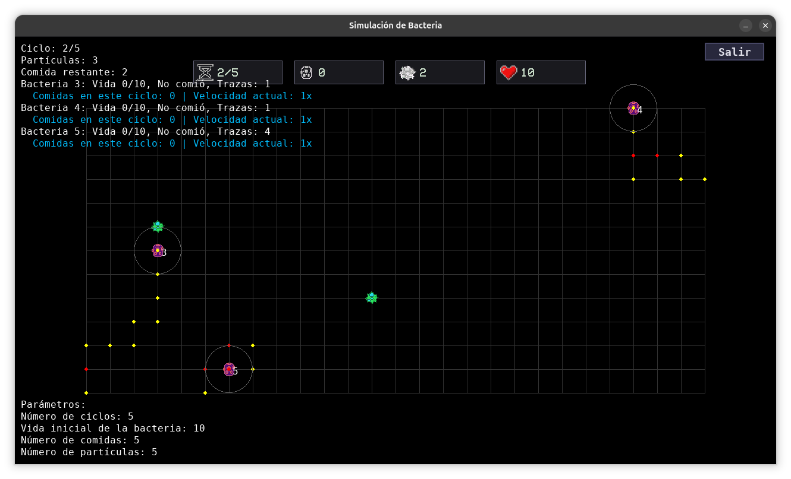

# Simulación de Caminata Aleatoria de Bacterias

Este proyecto simula la caminata aleatoria de bacterias en un entorno de cuadrícula utilizando **Pygame**, con una interfaz gráfica estilizada como un panel de laboratorio (HUD terminal).



## Características

- **Simulación de Biología Computacional:** Caminata aleatoria de bacterias con comportamiento adaptativo.
- **Interfaz Gráfica Integrada:** Menú principal, ventana de configuración y panel de ayuda desarrollados completamente en Pygame, sin dependencias de librerías de UI externas (estilo "Laboratorio/Terminal").
- **Detección de Colisiones y Alimentación:** Las bacterias detectan comida y compiten por los recursos.
- **Sistema de Velocidad Variable:** Basado en el éxito de alimentación en cada ciclo; consumir 2 o más comidas incrementa la velocidad.
- **Estadísticas y HUD en Tiempo Real:** Interfaz superior con contadores tipo iconos para el estado actual de la simulación.
- **Pantalla Modal de Fin de Juego:** Estadísticas de población final con un efecto visual estilo "frosted glass".
- **Modo Debug Integrado:** Visualiza rastros dejados por las bacterias (trazas de calor), solapamientos en las rutas y estadísticas internas (`Ctrl+D`).

## Galería del Proyecto

### 🔬 Laboratorio y Configuración

*Pantalla de ayuda integrada explicando las normativas y controles de la simulación.*

### 🧫 Simulación en Ejecución

*Bacterias interactuando en la placa de Petri (cuadrícula). El HUD superior mantiene el recuento en la parte superior del estado y recursos.*

### 🛠️ Modo Depuración (Debug Mode)

*Visualización avanzada presionando `Ctrl+D` durante la simulación. Muestra las áreas de repulsión, velocidad exacta, trazas dejadas en ciclos de movimiento, y superposiciones.*

## Parámetros Configurables

Antes de iniciar cada simulación, se pueden ajustar los siguientes valores:
- **N° Ciclos:** Duración total de la simulación.
- **Vida de Bacteria Inicial:** Umbral de vida para sobrevivir.
- **Cantidad Inicial de Comida:** Recursos disponibles en la placa.
- **Población Bacteriana Inicial:** Número base de especímenes.

## Requisitos

- Python 3.x
- **Pygame** (Versión 2.0+)

> [!NOTE]
> En iteraciones pasadas se requería PyQt5 para el menú de inicio; actualmente todo el ecosistema gráfico está puramente construido sobre Pygame.

## Instalación

1. Clona el repositorio:
    ```sh
    git clone https://github.com/tu_usuario/Simple-random-walk-bacteria.git
    cd Simple-random-walk-bacteria
    ```

2. Instala los paquetes requeridos:
    ```sh
    pip install -r requirements.txt
    ```

## Uso

1. Ejecuta el archivo principal:
    ```sh
    python main.py
    ```

2. Controles dentro de la simulación:
    - `Ctrl+D`: Activa o desactiva la información de depuración para ver trayectorias matemáticas y variables ocultas.
    - Botón HUD "Salir": Para regresar al menú anticipadamente.
    - `ESC`: Para cerrar modales o finalizar cuando se agotan los recursos.

## Estructura de Archivos

- `main.py`: Punto de entrada del programa. Manejador de estado de las pantallas.
- `simulation.py`: Núcleo matemático y logíco de la caminata aleatoria y colisiones.
- `bacteria.py`: Clase y comportamientos individuales de cada espécimen.
- `config.py`: Centralización de variables, constantes físicas y paleta de colores.
- `gui.py`: Componentes gráficos reutilizables (Botones, Entradas de texto estilo panel).
- `main_menu.py`, `help_menu.py`, `config_menu.py`: Interfaces de navegación previas a la simulación.
- `resource_manager.py`: Sistema de gestión de assets e íconos.
